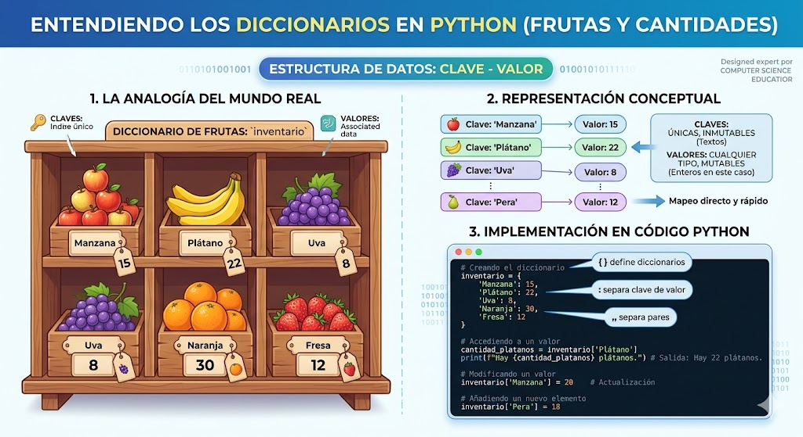

# DIGCIONARIOS EN PYTHON
conseptos y ejercicios de digccionarisos en python

los diccionarios son datos estructurados, es decir hacen referencia a una coleccin de datos 

son una coleccion de sordenada de pares de datos de la forma **clave:valor**, conosidos como elementos o items

son mutables, una vez definido de le pude agregar nuevos elementos, modificar o leliminar algunos de los que ya tiene 

tambien son conocidos como arreglos asociativos     

## REPRESENTACION GRAFICA DE UN DIGCIONARIO 

                                                                                                                                                                                                                                                                                                       


## Sintaxis 
`nombre_diccionarios = [clave1:valor1, clave2:valor2,...]`

- cada item o elemento tiene la forma **clave:valor**
- Encada item hay una clave y 1 o mas valores. si se desconose el valor. se puede completar con *None*
- los elementos del diccionario se indexan por clave.
- las claves solo pueden ser datos inmutables 
- los datos pueden ser datos mutables o inmutables 
- las claves no pueden repetirse dentro de un diccionario


### EJEMPlO

`frutas = {"manzana",34, "pera",45}`

## Operaciones 

### Agregar elelmentos 

`nombre_digcionario[clave] = valor`

`frutas["cereza"] = 90`

### Consultar o modificar elementos 

`print(el valor de pera es: ', frutas [pera])`

### Eliminar elementos 

`del frutas[´pera´]`

### Operador de pertenencia 

``` py
if 'cereza' in frutas:
    print('si esta cereza en el digcionario')
else:
    print('No esta cereza en el diccionario')        
```

## Ejercicin
Cree un programa en Python que utilice un diccionario para guardar los nombres de sus amigos y su telefono.  En este caso, el diccionario representa una agenda telefónica.  El programa pedirá nombres y telefonos y los irá guardando en el diccionario (los nombres en mayúscula).  Además, el programa debe permitir consultar o eliminar un telefono.  Incluya un menú de opciones.